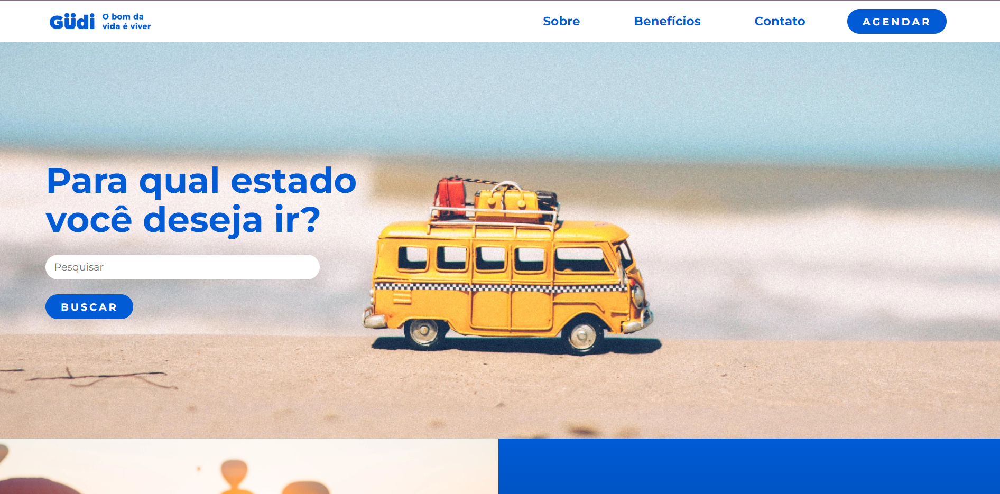
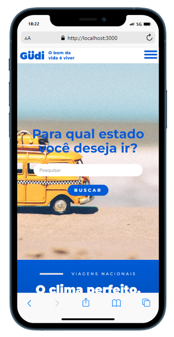

# Desafio - #VaiNaWeb

Projeto Desenvolvido em React.Js, utilizando Typescript e SASS, para o desafio do #VaiNaWeb.

##### Template Base: https://xd.adobe.com/view/7685b23a-03a3-4d0c-a563-0855e94e046b-23d6/specs/

## O que foi Utilizado:
* HTML
* SASS
* Typescript
* React.Js

## Implementações Feitas:
* Responsividade

#### Deploy: https://vwn-cs7.netlify.app/

##### Meu LinkeDin: 

